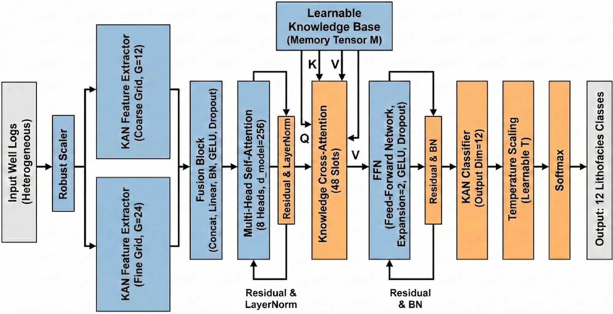

# FaciesKAN: Two-stage Attention Kolmogorov-Arnold Network for Probabilistic Lithofacies Prediction from Well Logs

By: Joshua Atolagbe & Ardiansyah Koeshidayatullah
(Department of Geosciences, King Fahd University of Petroleum & Minerals)

Submitted to 87th EAGE Conference & Exhibition 

# FaciesKAN architecture
 